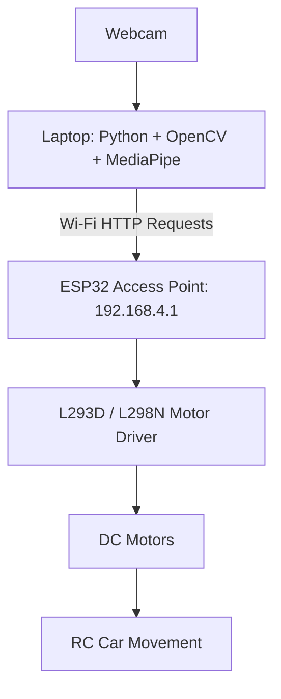

# ESP32 Hand Gesture Controlled RC Car

## Project Overview
This project implements a hand gesture controlled RC car using an ESP32, an L293D or L298N, and a laptop webcam. The ESP32 creates its own Wi-Fi Access Point and hosts a control web server at http://192.168.4.1. A Python program running on the laptop uses OpenCV and MediaPipe to detect hand gestures and send HTTP commands to the ESP32.

## Architecture


## Features
- Hand gesture based control
- ESP32 creates its own Wi-Fi Access Point
- No external router required
- Real-time command transmission using HTTP
- Compatible with both L293D and L298N motor drivers
- Web interface available for manual control
- Debug logs in Serial Monitor
- Works on macOS, Windows, and Linux

## Hardware Requirements
| Component | Quantity |
| :--- | :--- |
| ESP32 Dev Board | 1 |
| L293D or L298N Motor Driver | 1 |
| 2WD or 4WD RC Car Chassis | 1 |
| DC Gear Motors | 2 or 4 |
| Battery Pack (7.4V–12V) | 1 |
| Jumper Wires | As needed |
| Laptop with Webcam | 1 |
| USB Cable for ESP32 | 1 |

## Software Requirements
### Arduino Side
- Arduino IDE 2.3.0 or newer
- Espressif Systems ESP32 Board Package 3.0.0 or newer

### Python Side
- Python 3.10.x
- OpenCV (`opencv-python`) 4.11.0 or newer
- MediaPipe 0.10.14
- Requests 2.32.0 or newer

## Pin Configuration
### ESP32 to Motor Driver
| ESP32 GPIO | Motor Driver Pin | Description |
| :--- | :--- | :--- |
| GPIO 26 | IN1 | Left Motor Direction 1 |
| GPIO 27 | IN2 | Left Motor Direction 2 |
| GPIO 14 | ENA | Left Motor Speed (PWM) |
| GPIO 32 | IN3 | Right Motor Direction 1 |
| GPIO 33 | IN4 | Right Motor Direction 2 |
| GPIO 25 | ENB | Right Motor Speed (PWM) |
| GND | GND | Common Ground |

### L293D Wiring
| L293D Pin | Connection |
| :--- | :--- |
| Pin 1 (Enable 1,2) | GPIO 14 |
| Pin 2 (Input 1) | GPIO 26 |
| Pin 7 (Input 2) | GPIO 27 |
| Pin 3 (Output 1) | Left Motor Terminal A |
| Pin 6 (Output 2) | Left Motor Terminal B |
| Pin 9 (Enable 3,4) | GPIO 25 |
| Pin 10 (Input 3) | GPIO 32 |
| Pin 15 (Input 4) | GPIO 33 |
| Pin 11 (Output 3) | Right Motor Terminal A |
| Pin 14 (Output 4) | Right Motor Terminal B |
| Pin 16 (VCC1) | 5V Logic Supply |
| Pin 8 (VCC2) | Motor Battery Supply |
| Pins 4, 5, 12, 13 | GND |

### L298N Wiring
| L298N Pin | Connection |
| :--- | :--- |
| ENA | GPIO 14 |
| IN1 | GPIO 26 |
| IN2 | GPIO 27 |
| IN3 | GPIO 32 |
| IN4 | GPIO 33 |
| ENB | GPIO 25 |
| OUT1/OUT2 | Left Motor |
| OUT3/OUT4 | Right Motor |
| GND | ESP32 GND |
| 12V | Motor Battery Positive |

## Wi-Fi Configuration
| Parameter | Value |
| :--- | :--- |
| SSID | RC_CAR |
| Password | 12345678 |
| IP Address | 192.168.4.1 |
| Port | 80 |

## HTTP Endpoints
| URL | Action |
| :--- | :--- |
| `/forward` | Move Forward |
| `/backward` | Move Backward |
| `/left` | Turn Left |
| `/right` | Turn Right |
| `/stop` | Stop Motors |

## Gesture Mapping
| Fingers Shown | Command | Action |
| :--- | :--- | :--- |
| 1 | `forward` | Move Forward |
| 2 | `backward` | Move Backward |
| 3 | `left` | Turn Left |
| 4 | `right` | Turn Right |
| 5 | `stop` | Stop Motors |
| No Hand | `stop` | Stop Motors |

## Project Structure
```text
ESP32_Hand_Gesture_RC_Car/
├── esp32_rc_car.ino
├── hand_gesture_rc_car.py
└── README.md
```

## Installation Guide
### 1. Install Arduino IDE
Download and install [Arduino IDE](https://www.arduino.cc/en/software).

### 2. Install ESP32 Board Package
In Arduino IDE:
1. Open **Preferences**.
2. Add the ESP32 board URL: `https://raw.githubusercontent.com/espressif/arduino-esp32/gh-pages/package_esp32_index.json`
3. Open **Boards Manager**.
4. Install **ESP32 by Espressif Systems**.

### 3. Upload ESP32 Code
1. Open `esp32_rc_car.ino`.
2. Select **ESP32 Dev Module**.
3. Select the correct **COM/USB port**.
4. Click **Upload**.
5. Open **Serial Monitor** at **115200 baud**.

Expected output:
```text
ESP32 RC CAR READY
SSID      : RC_CAR
Password  : 12345678
IP Address: 192.168.4.1
Web server started successfully
```

## Python Environment Setup (macOS)
### Verify Python
```bash
python3 --version
```

### Upgrade pip
```bash
python3 -m ensurepip --upgrade
python3 -m pip install --upgrade pip
```

### Install Required Libraries
Create a file named `requirements.txt` with the following content, or install them directly:
```text
opencv-python
mediapipe==0.10.14
requests
```

Install using:
```bash
python3 -m pip install opencv-python mediapipe==0.10.14 requests
```

## Running the Project
1. **Power On the RC Car**: Turn on the ESP32 and motor driver.
2. **Connect Laptop to ESP32 Wi-Fi**:
   - SSID: `RC_CAR`
   - Password: `12345678`
3. **Test Browser Control**: Open http://192.168.4.1. The control page should appear.
4. **Run the Python Script**:
   ```bash
   python3 hand_gesture_rc_car.py
   ```
5. **Allow Camera Access**: Grant camera permission if prompted.
6. **Control the Car**: Show hand gestures to the webcam.
7. **Exit**: Press `q` to quit.

## Troubleshooting
- **Browser Cannot Open 192.168.4.1**: Verify ESP32 is powered and you are connected to the `RC_CAR` Wi-Fi.
- **Python Reports Connection Timeout**: Run `ping 192.168.4.1`. If unreachable, reconnect to the Wi-Fi.
- **MediaPipe Error**: Reinstall with `python3 -m pip install mediapipe==0.10.14`.
- **Camera Not Detected**: Check camera permissions in macOS Settings.

## Safety Notes
- Test with wheels lifted from the ground initially.
- Use a stable battery supply.
- Ensure all grounds are connected together.

## Future Improvements
- Speed control using hand distance
- Obstacle avoidance with ultrasonic sensors
- Live video streaming from an ESP32-CAM

## Author
**Bharath Kumar A**

## License
This project is intended for educational and demonstration purposes.
